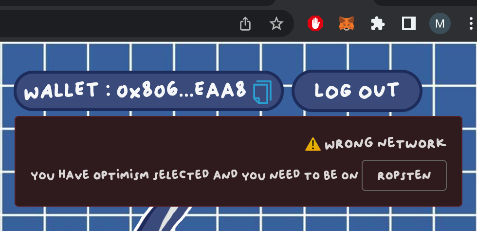

# Lost & Found NFT Marketplace Powered by 0x Protocol
##### A starter-kit for creating your own NFT collection + marketplace on top of 0x public marketplace protocols. oPeNsEa who ???
---
## Introduction - What Are We Doing Here ?
This guide will walk you step-by-step through the process of deploying your own NFT contract and creating a website that allows people to mint NFTs and list/buy/sell pieces from your collection on a marketplace. What is unique about this guide is that it uses [0x v4 NFT Swap Protocol](https://docs.0x.org/nft-support/docs/introduction) which enable anyone to list/buy/sell NFTs in a completely on-chain + permisonless + trustless fashion. If you want to learn more about the importance of open protocols, check out this [detailed thread](https://twitter.com/0xTranqui/status/1506722429208567819?s=20&t=yhPlg9n-hxi_tPGOouoqKw) I wrote about the subject. 

I cannot emphasize enough how important it is to be able to build on top of a public marketplace protocol that is both immutable (code will never change) + permisonless (no one can prevent you from access the code). For context, most of the web3 universe still relies on broad market aggregators like Opensea to facilitate the buying/selling of NFTs. However, relying on platforms like Opensea who use protocols that move crucial marketplace functions off-chain (ex: final settlement of orders) creates an enormous level of risk to the long term health + stability of the web3 ecocystem by introducing blackboxes around market data and the need to trust a centralized party (ex: Opensea) to remain a "good actor" in perpetuity. 

This repo gives you the tools to break the cycle, and claim full ownership/soveriengty over your digital assets and the marketplace where they are bought and sold. All made possible by 0x public marketplace protocols.
---
## 🏄‍♂️ Getting Started - IDE Setup + Environment Variables

> Clone the repo
```
gh repo clone 0xTranqui/lostandfound-optimism-marketplace
```

> Install
```
cd lostandfound-optimism-marketplace
yarn install
```

This 🏗 scaffold-eth fork is pointed at the **Ethereum Mainnet** out of the box (instead of localhost like usual).

Before we do anything, we will set up our environment variables which are needed to interact with both the frontend marketplace and 
contract deployment functionality of this repo. We will be setting up two different .env files, one at the root level of packages/react-app
and one at the root level of packages/hardhat
\
Open up your text editor (this guide assumes VSCode) to better navigate through your files:
```
cd lostandfound-optimism-marketplace
code . 
```
Navigate to + expand the the packages directory, and then right click on the react-app folder and create a new file. Name this file ".env"
Add in the following 2 lines of code:
```
REACT_APP_ALCHEMY_KEY = enter your key here (without quotes)
REACT_APP_ETHERSCAN_KEY= enter your key here (without quotes)
```
This allows the constants.js file in the react-app/src directory to pull these keys into the react-app without needing to expose them publicly.

Navigate to + expand the the packages directory, and then right click on the hardhat folder and create a new file. Name this file ".env"
Add in the following 6 lines of code (the mainnet lines are optional) :
```
ROPSTEN_ALCHEMY_KEY = enter your key here (without quotes)
ROPSTEN_ETHERSCAN_API_KEY = enter your key here (without quotes)
ROPSTEN_DEPLOYER_PRIV_KEY = enter your key here (without quotes)

OPTIMISM_ALCHEMY_KEY = enter your key here (without quotes)
OPTIMISM_ETHERSCAN_API_KEY = enter your key here (without quotes)
OPTIMISM_DEPLOYER_PRIV_KEY = enter your key here (without quotes)
```
This allows the hardhat.config.js file in the packages/hardhat directory to use these keys for the smart contract deployment and 
verification functionality we will be implementing without having to expose them publicly.

## Setting Up the Front End

From here, you can now run the following code to interact with your own local frontend that points at the existing Lost & Found marketplace located at   https://www.lostfound.world/. Note: it won't work unless you have set up the .env in pacakges/react-app. All you have to do is run the following from the root level of the project directory:
```
cd lostandfound-optimism-marketplace
yarn start
```

You now have a direct window into the Lost & Found marketplace! You'll notice that the app points at Optimism if you look at the top
right corner of the site, where the network the app is pointed at is listed. Both the NFT contract and 0x marketplace protocols live on
Optimism as well. You are "yarn-starting" into a production ready app!

We'll come back to learning how to edit the front end, but first lets reconfigure the app so that it points at ropsten which is a more 
suitable environment for testing

### App.jsx Updates (packages/react-app/src/App.jsx)

- Line 58: Replace "optimism" with "ropsten"
- Line 70: Replace "lostandFoundOptimism" with "lostandFoundContract4"
- Line 71: Replace "0xa4248aC1a4Fc557134802f39cddF830Fde6DdA06" with "0x9fd7ad2ecf7510eddcf0e6a345188d9df23805ac"
- Line 72: Replace "zeroExErc721StatusOPTIMISM" with "zeroExErc721OrdersFeatureROPSTEN"

### OldEnglish.jsx Updates (packages/react-app/src/views/OldEnglish.jsx)

- Line 13: Change the subgraph APIURL from optimism link: 'https://api.thegraph.com/subgraphs/name/0xtranqui/zeroex-nft-swap-v4-optimism-v4' to ropsten link: 'https://api.thegraph.com/subgraphs/name/0xtranqui/zeroex-nft-swap-v4-ropsten-v2'
- Line 19 - 24: Artist royalty is hardcoded as 15% of each sale and that royalty payment is hardcoded to be split between two addresses. You can adjust the royalty % by changing the "artistRoyalty" in line 19. You can adjust the royalty payout addresses by changing the addresses in lines 23-24. If you change line 22 "numberOfRoyaltyPayoutRecipients", make sure to follow the instructions in the comments on that line about adjusting the fee structs that are passed into the Create Order flow

When you press save (on both files) to run this code, you will get a pop up on the site that alerts you that you are on the wrong network and you
need to switch to ropsten to continue using the app. Follow those instructions :)



If you have completed all these steps, you should now be looking at a locally hosted + ropsten version of https://www.lostfound.blue/ !!!

The 0x contract protocols have been swapped for their ropsten counterparts, and the Lost & Found, Vol. 1 Reloaded NFT collection has been
swapped with a ropsten version of it with the same exact metadata (this was one of the test contracts I used during the creation of this project)

You can now experiment with interacting with the 0x marketplace protocol in a no-cost environment (you just need some ropsten-ETH, which you can get here: https://faucet.egorfine.com/). I encourage you to check out react/app/src/views/OldEnglish.jsx to look at how the interactions with the 0x protocol are implemented. I relied heavily on [documentation](https://docs.swapsdk.xyz/) from the [trader.xyz](https://trader.xyz/) team to build this out. 

You can also experiment with changing the structure + style of the website (if yellow lined-paper isn't your thing) by playing with
Marketplace.css (which styles OldEnglish.jsx), App.css, Mint.css, and About.css (among others). Build something crazy, and share it with me on twitter at https://twitter.com/0xTranqui !!!

Let's keep moving forward to creating the metadata for your NFT project and deploying the smart contract to ropsten so you can start testing what it would be like
to handle the full scope of work required in the deployment of an NFT project.

## NFT Metadata Creation + Decentralized File Storage on IPFS

To begin, here is a (lengthy) step-by-step guide to creating and storing your own metadata to IPFS:

- Go to https://www.721.so/
- Click on "create an NFT collection" Artkit flow
- Create New Collection (we will be uploading our own art for this)
- Click the nav burger in the top left corner
- Click "tokens" -> "set collection size" -> set your collection size (set it to 12 if you want it to match with the template NFT smart contract in this repo)
- Uncheck the "File To Duplicate" Box, and click "Update Collection"
- Click the arrow arrow next to the 2 x 2 box that sits underneath the nav burger we clicked previously
- Click on the metadata folder to expand it
- For each token.json file, fill in the name, description, and upload an image file (from your computer). If you don't have any art to use,
use the free-to-use CC0 art from the Lost & Found, Vol. 1 collection! Here's a [link](https://bafybeihcuklo4pmohys7j7xu5uvfpeqgg63wbdkjrx5xrma7mbyy6oxojm.ipfs.dweb.link/) to the ipfs folder holding the .png files (even better, download this art, remix it, and then tag [me](https://twitter.com/0xTranqui) and the [artist](https://twitter.com/dannydiamondss) in your final product when you finish!!!) 
  - For example file sizes, the Lost & Found, Vol. 1 collection used .png files between 3-5 MB, all with 1:1 aspect ratios
  - The "Animation URL" and "External URL" allow you to upload multimedia files / links to static HTML websites, howver you still need to provide\
    an image file to act as a thumbnail if you are planning to link to an animation/external URL
  - You can also add in attributes for each NFT below the main data section
- Obviously repeating this process for large collections could be very time consuming, so luckily there is some nice UI that allows you to shift click    on multiple tokens at once to apply edits to multiple files at the same time\
- Once complete, click on the urger again and go to file -> save as. This will save a .zip copy of your metadata, which you shold store locally for record keeping
- Now that youre metadata is set + saved, go to the burger again and click publish -> upload to IPFS
- You will then get prompted to get an API key from nft.storage (IPFS pinning service). Go and do this -> https://nft.storage/ -> login (make an account) -> API keys -> New key -> copy key and paste back into the API key input we left off on at https://www.721.so/\
- "Click Publish to IPFS!"
- Wait for the files to be pinned, and you'll eventually see two checkmarks that tell you the process is complete. One is for uploading of the assets (.png files), the other is for uploading the metadata (.json files that include a key called "image" who's value-pair is a link to the corresponding .png file for that token).
- You will be prompted with two different things to copy. Save them both for later, we will need them !!! Also follow the links to the assets folder and metadata folder provided at the bottom of the popup and save those links for easy nagivation later as well.\

That's it! At this point, you could actually continue forward creating your own contract with the 721.so contract builder, and then creating your own minting page using the 721.so mint page builder. Both are amazing tools which I have used in the past. For our case, we are going to leave studio https://www.721.so/ to deploy our own smart contract already configured in our packages/hardhat directory of this repo, which we can then mint from using the minting page that is also set up in the website template as well\

## SMART CONTRACT DEPLOYMENT + FRONT END INTEGRATION

We are going to skip a lot of steps/background information so that you use what's already in this repo to deploy your own NFT contract as simply as possible. Here is a step by step process for what to do:

- Navigate to packages/hardhat directory
- Double check that your .env at the root level of this directory is set up correctly (look back earlier in this guide if unsure)
- Open hardhat/config.js
- Line 29: Change "mainnet" to "ropsten"
- Line 88-91: Un-comment these 4 lines that relate to the ropsten configuration. If you are unsure how to do this, just mirror the formatting of the optimism configuration that is not commented out in line 101-104. You won't be able to deploy successfully if you do this incorrectly
- Line 101-104: Comment out the 4 lines that relate to the optimism configuration.
- Open hardhat/contracts/lostandfound_vol_1_reloaded.sol
- On line 91 of the contract, replace the contract URI you see here with the contract URI you created during the artkit process! Told you we were going to need this later. Mimic the out-of-the-box formatting of this line exactly
- In your terminal, run:
```
cd packages/hardhat
npx hardhat clean
npx hardhat compile
```
Your contract is almost ready to be deployed. More steps:
- Open hardhat/deploy/deploy_LF_ERC721.js
- On line 12 args, replace the contractURI with the contract URI you saved earlier! (I acknowledge this is repetivive, but I beleive these two inputs are serving slightly different purposes. Or I'm wrong and this is a redundant unncessary step. But if you don't know what you're doing, do this just to be safe)
- We will now deploy the contract. In your terminal, run:
```
cd lostandfound-optimism-marketplace
yarn deploy
```
- Contract deployed to ropsten! Copy the address your contract was deployed to and save it for the next step.
- We will know verify the contract. In your terminal, run:
```
cd packages/hardhat
npx hardhat verify --network ropsten "insert contract address here w/o quotes" "insert the constructor argument you entered in line 12 of deploy_LF_ERC721.js EXACTLY how you entered it (in quotes)"
```
Your contract is now verified on etherscan! This means other people can see into the innerworkings on your contract now on etherscan (which is great for transparency + having trustworthy code)

Here are the final steps to link your now published NFT contract into your front end (replacing the template project that was included in this repo):
- Navigate back to packages/react-app/src/contracts/external_contracts.js
- Replace the addresss for lostandFoundContract4 on line 6126 with your newly deployed contract. No need to touch the ABI because it is the exact same contract from a structural standpoint
- Navigate to packages/react-app/src/views/App.jsx and replace the contract address on line 71 with your newly deployed contract address
- Save files (I hope you've been saving your files everytime I've been giving you step by step directions lol).
- That's it, you can now run the following code to restart your front end and it will open up the site with your own NFT contract installed:
```
cd lostandfound-optimism-marketplace
yarn start
```
You'll notice that know images load on the marketplace page. That is because you have to mint some NFTs first before they populate. Head on over to the mint page to mint your pieces (max 2 per wallet with this contract), and then check them out in the marketplace.

DONE !!!!

* Last optional step if you want to deploy a rough website that your friends can mess around with. Run:
```
cd lostandfound-optimism-marketpalce
yarn build
yarn surge
```

Save the URL and share with your friends. You now have your very own custom NFT project + 0x powered marketplace live on ropsten !!!

Fin 🏁🏁
