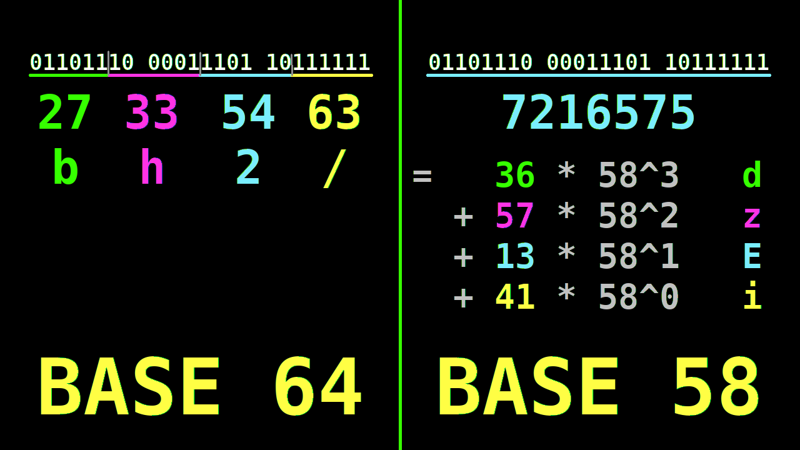

# Base58/Base64 Bytestring Encoding Schemas



Base64 and Base58 are two algorithms for encoding byte arrays to plain text. I
initially assumed these were two instances of the same "Base N" algorithm. **This
is not the case. These are two fundamentally different algorithms.**

Base64 is simpler. It treats your byte array as a stream of bytes. It encodes 3
bytes at a time, into 4 characters (`3 bytes -> 24 bits -> 4 groups of 6 bits
-> 4 letters`). There is a table to convert 6-bit integers to letters which you
can look up on wikipedia. There is also a padding rule to deal with bytestrings
whose byte length is not a multiple of 3.

Base58 is more complex. Roughly, base58 thinks of the byte array as a very long
unsigned integer, and then encodes that integer into base58 using the normal
quotient-remainder algorithm (will explain below if unfamiliar). Notionally, it
is

```
%% NOTIONAL code
b58_enc(ByteArray) ->
    <<N:(bit_size(ByteArray))>> = ByteArray,
    erlang:integer_to_list(N, 58).
```

There's a different padding rule in Base58, this time for the case where the
byte array contains leading `0`s (the strings `000123` and `123` point to the
same integer, but are different byte arrays).

## tldr

Full working/tested examples:

- [Base64 Erlang](https://github.com/aeternity/Vanillae/blob/829dd2930ff20ea0473cf2ad562e0a1c2aba0411/utils/vw/src/vb64.erl)
- [Base64 TypeScript](https://github.com/aeternity/Vanillae/blob/pharpend/develop/bindings/typescript/src/b64.ts)
- [Base58 Erlang](https://github.com/aeternity/Vanillae/blob/829dd2930ff20ea0473cf2ad562e0a1c2aba0411/utils/vw/src/vb58.erl)
- [Base58 TypeScript](https://github.com/aeternity/Vanillae/blob/829dd2930ff20ea0473cf2ad562e0a1c2aba0411/bindings/typescript/src/b58.ts)

If you're doing this in a language that doesn't have bignum arithmetic... good
luck friend.

```erlang
-spec b64_enc(Bytes) -> Base64
    when Bytes  :: binary().
         Base64 :: string().
%% @doc
%% Encode a byte array into a base64 string
%% @end

%% general case: at least 3 bytes (24 bits) remaining
%% encode into 4 characters
b64_enc(<<A:6, B:6, C:6, D:6, Rest/binary>>) ->
    CA = b64_int2char(A),
    CB = b64_int2char(B),
    CC = b64_int2char(C),
    CD = b64_int2char(D),
    [CA, CB, CC, CD | b64_enc(Rest)],
%% terminal case: 2 bytes (= 16 bits) remaining
%% encode into 3 characters and a single padding character
b64_enc(<<A:6, B:6, C:4>>) ->
    CA = b64_int2char(A),
    CB = b64_int2char(B),
    CC = b64_int2char(C bsl 2),
    [CA, CB, CC, $=];
%% terminal case: 1 bytes (= 8 bits) remaining
%% encode into 2 characters and two padding characters
b64_enc(<<A:6, B:2>>) ->
    CA = b64_int2char(A),
    CB = b64_int2char(B bsl 4),
    [CA, CB, $=, $=];
%% terminal case: empty byte array
b64_enc(<<>>) ->
    [].


-spec b64_dec(Base64) -> Bytes
    when Base64 :: string(),
         Bytes  :: binary().
%% @doc
%% Decode a base64 string into a byte array
%% @end

b64_dec(Base64_String) ->
    b64_dec(Base64_String, <<>>).


%% terminal case: two equals signs at the end (decode 1 byte)
b64_dec([W, X, $=, $=], Acc) ->
    NW = b64_char2int(W),
    NX = b64_char2int(X),
    <<LastByte:8, 0:4>> = <<NW:6, NX:6>>,
    <<Acc/binary, LastByte:8>>;
%% terminal case: one equals sign at the end (decode 2 bytes)
b64_dec([W, X, Y, $=], Acc) ->
    NW = b64_char2int(W),
    NX = b64_char2int(X),
    NY = b64_char2int(Y),
    <<B1:8, B2:8, 0:2>> = <<NW:6, NX:6, NY:6>>,
    <<Acc/binary, B1:8, B2:8>>;
%% terminal case: end of string
b64_dec([], Acc) ->
    Acc;
%% general case: 4 or more chars remaining (decode 3 bytes)
b64_dec([W, X, Y, Z | Rest], Acc) ->
    NW = b64_char2int(W),
    NX = b64_char2int(X),
    NY = b64_char2int(Y),
    NZ = b64_char2int(Z),
    NewAcc = <<Acc/binary, NW:6, NX:6, NY:6, NZ:6>>,
    b64_dec(Rest, NewAcc).


-spec b58_enc(Bytes) -> Base58
    when Bytes  :: binary(),
         Base58 :: string().
%% @doc
%% Encode a bytestring into base58 notation

b58_enc(Bytes) ->
    %% grab leading 0s
    {ZerosBase58, Rest}        = split_zeros(Bytes, []),
    NBitsInRest                = bit_size(Rest),
    <<RestBigNum:NBitsInRest>> = Rest,
    RestBase58                 = b58_enc(RestBigNum, []),
    ZerosBase58 ++ RestBase58.


-spec split_zeros(Bytes, B58_Zeros_Acc) -> {B58_Zeros, Rest}
    when Bytes         :: binary(),
         B58_Zeros_Acc :: string(),
         B58_Zeros     :: string(),
         Rest          :: binary().
%% @private
%% Base58 thinks of your byte array as a big integer, and therefore has no way
%% to distinguish between say <<1,2,3>> and <<0, 0, 0, 1, 2, 3>>. To resolve
%% this, we prepend ASCII `1`s at the beginning of the result, one for each
%% leading zero byte in the input byte array.
%%
%% The ASCII `0` (numeral zero) character is not used in order to avoid
%% ambiguity with ASCII `O` (uppercase letter O)

split_zeros(<<0:8, Rest/binary>>, B58_Zeros) ->
    split_zeros(Rest, [$1 | B58_Zeros]);
split_zeros(Rest, B58_Zeros) ->
    {B58_Zeros, Rest}.


-spec b58_enc(BytesBigNum, Base58Acc) -> Base58
    when BytesBigNum :: integer(),
         Base58Acc   :: [0..57],
         Base58      :: string().
%% @private
%% Encode a number into base58 notation using the standard quotient-remainder
%% algorithm you would use for any other base.

b58_enc(0, Acc) ->
    lists:map(fun b58_int2char/1, Acc);
b58_enc(BitNum, Acc) ->
    Q = BitNum div 58,
    R = BitNum rem 58,
    b58_enc(Q, [R | Acc]).


-spec b58_dec(Base58) -> DecodedBytes
    when Base58       :: string(),
         DecodedBytes :: binary().
%% @doc
%% Decode a Base58-encoded string into a bytestring
%% @end

%% this works by parsing the string as an integer and then converting the
%% integer to "base 256" (256 = 2^8)
b58_dec(Str) ->
    %% the number of leading 1 in the input plain-text string tells us the
    %% number of leading zeros in the output byte array
    {LeadingZeros, RestStr} = split_ones(Str, <<>>),
    %% you could make this more efficient by converting this to a single pass
    %% over the input string. steps shown separately because this is tutorial
    %% code
    RestNs                  = lists:map(fun b58_char2int/1, RestStr),
    RestBytes               = b58_dec(RestNs, 0),
    <<LeadingZeros/binary, RestBytes/binary>>.

%% this is basically the oppsite of split_zeros/2 above
split_ones([$1 | Rest], LeadingZeros) ->
    split_ones(Rest, <<LeadingZeros/binary, $1>>);
split_ones(B58Str, LeadingZeros) ->
    {LeadingZeros, B58Str}.


%% this parses the input symbols into a big integer
b58_dec([N | Ns], Acc) ->
    NewAcc = (Acc*58) + N,
    b58_dec(Ns, NewAcc);
%% then converts that big integer into "base 256" (i.e. a byte array)
b58_dec([], FinalAccN) ->
    bignum_to_binary_bige(FinalAccN, <<>>).

%% in the encode step, we were converting the number to a base58 "string"
%% here we are doing essentially the same thing, but instead converting the
%% number to a "base 256 string" (i.e. byte array)
bignum_to_binary_bige(0, Acc) ->
    Acc;
bignum_to_binary_bige(N, Acc) ->
    Q = N div 256,
    R = N rem 256,
    NewAcc = <<R, Acc/binary>>,
    bignum_to_binary_bige(Q, NewAcc).
```


## The quotient-remainder algorithm

This is the algorithm for converting a "pure" integer into an arbitrary base.
[There is a version of this algorithm that computes the decimal representation
of a fraction, called "long division", which you probably learned in
school.](https://www.bitchute.com/video/Jfk13sfYnxKI/)

Let's write the number `1234` in base `10`

```
1234  = 123*10 + 4
quotient        remainder
123             4
-----------     -----------
1234 div 10     1234 rem 10


123 = 12*10 + 3
quotient        remainder
12              3
-----------     -----------
123  div 10     123  rem 10


12 = 1*10 + 2
quotient        remainder
1               2
-----------     -----------
12   div 10     12   rem 10


1 = 0*10 + 1
quotient        remainder
0               1
-----------     -----------
1    div 10     1    rem 10
```

The algorithm in general is pretty simple

```erlang
%% Base 1 makes no sense
digits(N, Base) when N > 0, Base > 1 ->
    digits(N, Base, []);
%% have to handle 0 specially because digits/3 will return [] in this case
digits(0, _Base) ->
    [0].


%% general case
digits(N, Base, DigitsAcc) when N > 0 ->
    Q            = N div Base,
    R            = N rem Base,
    NewN         = Q,
    NewDigitsAcc = [R | DigitsAcc],
    digits(NewN, Base, NewDigitsAcc);
%% terminate when N = 0
digits(0, _Base, Digits) ->
    Digits.
```

Let's walk through the call chain for `digits(1234, 10)`

```
%% first case is successful on digits/2
digits(1234, 10) when 1234 > 0, 10 > 1 ->
    digits(1234, 10, [])

%% general case of digits/3
digits(1234, 10, []) when 1234 > 0 ->
    Q            = 123 = 1234 div 10
    R            =   4 = 1234 rem 10
    NewN         = 123 = Q,
    NewDigitsAcc = [4] = [R | []],
    digits(123, 10, [4])

%% general case of digits/3
digits(123, 10, [4]) when 123 > 0 ->
    Q            = 12  = 123 div 10
    R            =  3  = 123 rem 10
    NewN         = 12  = Q,
    NewDigitsAcc = [3, 4] = [R | [4]],
    digits(12, 10, [3, 4])

%% general case of digits/3
digits(12, 10, [3, 4]) when 12 > 0 ->
    Q            = 1   = 12 div 10
    R            = 2   = 12 rem 10
    NewN         = 1   = Q,
    NewDigitsAcc = [2, 3, 4] = [R | [3, 4]],
    digits(1, 10, [2, 3, 4])

%% general case of digits/3
digits(1, 10, [2, 3, 4]) when 1 > 0 ->
    Q            = 0            = 1 div 10
    R            = 1            = 1 rem 10
    NewN         = 0            = Q,
    NewDigitsAcc = [1, 2, 3, 4] = [R | [2, 3, 4]],
    digits(0, 10, [1, 2, 3, 4])

%% terminal case of digits/3
digits(0, 10, [1, 2, 3, 4]) ->
    [1, 2, 3, 4].
```

If we convert `1234` into base 58, it is

```
%% first case is successful on digits/2
digits(1234, 58) when 1234 > 0, 58 > 1 ->
    digits(1234, 58, [])

%% general case of digits/3
digits(1234, 58, []) when 1234 > 0 ->
    %% 1234 = 21*58 + 16
    Q            = 21   = 1234 div 58
    R            = 16   = 1234 rem 58
    NewN         = Q    = 21,
    NewDigitsAcc = [16] = [R | []],
    digits(21, 58, [16])

%% general case of digits/3
digits(21, 58, [16]) when 21 > 0 ->
    %% 21 = 0*58 + 21
    Q            = 0        = 21 div 58
    R            = 21       = 21 rem 58
    NewN         = 0        = Q,
    NewDigitsAcc = [21, 16] = [R | [16]],
    digits(0, 58, [21, 16])

%% terminal case of digits/3
digits(0, 58, [21, 16]) ->
    [21, 16]
```

## Miscellany

Notice that with the larger base, the algorithm terminates in fewer steps (i.e.
requires fewer digits).  This is why we use large bases like `64` and `58`.

Converting the "digits" to the proper base58 text representation is a matter of
looking up `21` and `16` in a table.

```
9> vb58:enc(<<1234:16>>).
"NH"
10> vb58:dec("N").
<<21>>
11> vb58:dec("H").
<<16>>
```

In the special case where the bytestring contains no leading `0` bytes and its
byte length is a multiple of `3`, then these are indeed two instances of the
same "base N" algorithm. Base 64 is considerably faster because `64` is a power
of 2, and therefore the algorithm can be written using bit operations (i.e.
without integer division).

The idea of Base58 is to be "Base64 that guards against manual entry errors."
So it excludes characters with visual ambiguity (e.g. `0O`, `lI1`), or
characters where text display programs might break long lines (e.g. `-/`).

Because Base58 is so computationally expensive, it is generally only used for
bytestrings that have a small, fixed size, and where manual entry is likely
to be a concern; for instance, Aeternity public keys are *always* 32 bytes
long, and are likely to be communicated over email or on paper.  Base64 is
used for bytestrings with a large/variable/unknown size; for instance,
Aeternity transactions can have arbitrary payloads, and are in some sense
ephemeral, unlikely to be written on paper.

Moreover, in practice, we will add a 4-byte checksum to the end of bytestrings
before doing BaseN encoding to guard against manual entry or copy/paste errors.

```erlang
encode_account(PubKey_Bytes) ->
    <<CheckBytes:4/binary, _/binary>> = crypto:hash(sha256, crypto:hash(sha256, Pubkey_Bytes)),
    "ak_" ++ base58:encode(<<Pubkey_Bytes, CheckBytes>>).
```

### Base58 is a two step conversion

We like to think of `binary()` as a sequence of `1`s and `0`s (i.e. **bits**).
But... strictly speaking, it's more correct to think of a `binary()` as a
sequence of **bytes**. A **byte** has a value between `0` and `255`, which
conventionally we think of as 8 bits. But really, the bytes are what is real
and the bits are a chimp brain fantasy.

So, when we're converting a bytestring to "base 58", really, it's a two step
conversion:

```
                     ---------- "encode" ------->
erlang type : binary()  <-> integer()       <-> string()
math type   : Base256   <-> "pure integer"  <-> Base58
                     <--------- "decode" --------
```

Now, of course, under the hood, everything is really binary. And I mean
`binary()`... bytes, not bits.  But at the Erlang (and TypeScript) level of
fakery, the correct (or at least simple) way to think about Base58 is as a
two-step conversion: `bytestring <-> integer <-> text`.

I provided examples in TypeScript and Erlang because those are the two
languages we use most commonly in Aeternity. Luckily, both have built-in bignum
(arbitrary size integer) arithmetic.  If you're doing this in a language like C
that doesn't have bignum arithmetic, you're going to have to interleave in the
bignum logic yourself.  Have fun.
