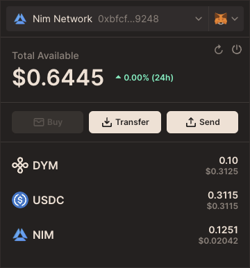

# Dymension Connect
<p align="center">
  
</p>

## Overview
The Dymension Connect Widget allows RollApps to easily integrate wallet connection functionality into their applications, 
facilitating user interactions with blockchain accounts. 
Designed to be framework-agnostic, this widget can be seamlessly incorporated into projects built with React, Vue, Angular, or vanilla JavaScript.

## Usage
To integrate the Dymension Connect Widget into your application, follow these steps:

### Step 1: Define Environment and Network
Specify the connection URL and network ID for your widget instance. These should match the blockchain network your application interacts with.
```javascript
const DYMENSION_CONNECT_URL = 'https://portal.dymension.xyz/';
const DYMENSION_CONNECT_NETWORK_ID = 'dymension_1100-1';
```

### Step 2: Embed the Widget
Embed the Dymension Connect Widget into your application using an iframe. This setup enables your users to interact with the widget directly from your UI.
```jsx
<iframe
    ref={iframeRef}
    onLoad={initModal}
    style={{ display: dymensionConnectOpen ? 'block' : 'none' }}
    allow="clipboard-read; clipboard-write"
    title="dymension-connect"
    className="dymension-connect-iframe"
    src={`${DYMENSION_CONNECT_URL}/connect?networkId=${DYMENSION_CONNECT_NETWORK_ID}`}
/>
```

### Step 3: Communicate with the Widget
Maximize the utility and adaptability of the Dymension Connect Widget within your application by leveraging direct messaging. 
This advanced method enables real-time communication with the widget's iframe, allowing you to dynamically adjust its appearance and behavior to suit user interactions and your application's styling needs. 
Utilize the postMessage API to send messages from your application to the widget, enhancing user experience through customization and control.
```javascript
const sendMessage = useCallback((message) => {
    iframeRef.current?.contentWindow?.postMessage(message, DYMENSION_CONNECT_URL);
}, []);

sendMessage({
    type: 'stylesChange',
    styles: {
        '--black-light': 'rgb(63 81 59)',
        '--black-light-rgb': '63, 81, 59',
        '--black-dark': 'rgb(27 40 24)',
        '--black-dark-rgb': '27, 40, 24',
        '--background-color': 'rgb(42 59 42)',
        '--background-color-secondary': 'rgb(63 78 63)'
    }
});
sendMessage({type: 'menuAlignChange', align: 'center'});
```
#### Optional messages that can be sent to the widget:
- **`triggerBoundingRectChange`**: Adjusts the widget's position by specifying the trigger element's bounding rectangle.
    ```javascript
    sendMessage({ type: 'triggerBoundingRectChange', rect: /* DOMRect object */ });
    ```
- **`stylesChange`**: Modifies the widget's styles to better match your application's theme.
    ```javascript
    sendMessage({
        type: 'stylesChange',
        styles: {
            '--control-color-normal': 'yourValue',
            '--background-color': 'yourValue',
            '--background-color-secondary': 'yourValue',
            // Add more custom style properties as needed
        }
    });
- **`menuAlignChange`**: Alters the alignment of the widget's menu relative to the trigger element, enhancing layout consistency and visual harmony.
    ```javascript
    sendMessage({ type: 'menuAlignChange', align: 'center' /* Or 'left', 'right' */ });
    ```
  
### Step 4: Listen for Messages from the Widget
To create a fully interactive experience, your application should listen for messages from the Dymension Connect Widget. 
This allows your app to react to user actions within the widget, such as connecting or disconnecting a wallet. 
Implement the listener within a `useEffect` to handle these messages appropriately:
```javascript
useEffect(() => {
    const handleMessage = (event) => {
        if (event.origin !== DYMENSION_CONNECT_URL) {
            return;
        }
        switch (event.data.type) {
            case 'ready':
                setDymensionConnectReady(true);
                break;
            case 'close':
                setDymensionConnectOpen(false);
                break;
            case 'connect':
                setAddress(event.data.hexAddress);
                updateTriggerBoundingRect();
                break;
            case 'disconnect':
                setAddress('');
                updateTriggerBoundingRect();
                break;
            default:
                break;
        }
    };

    window.addEventListener('message', handleMessage);
    return () => window.removeEventListener('message', handleMessage);
}, [initModal, sendMessage, updateTriggerBoundingRect]);
```
#### Optional messages that can be received from the widget:
- **`ready`**: Indicates the widget has fully loaded and is ready for user interaction.
- **`close`**: Signifies the user has closed the widget, allowing you to hide the widget interface or reset its state.
- **`connect`**: Notifies that a user has successfully connected their wallet. This message includes the user's address (bech32 address and hexAddress), enabling you to update the UI or trigger further actions.
- **`disconnect`**: Indicates the user has disconnected their wallet. Use this message to clear user data from your UI or revert to a default state.

Listening for these messages and implementing corresponding actions in your application ensures a seamless and responsive experience for users interacting with the Dymension Connect Widget.

## Example
For a complete example of how to integrate and use the Dymension Connect Widget in a React application, refer to the provided sample code in this repository.

## Support
For issues, questions, or contributions, please open an issue or pull request in the repository.
