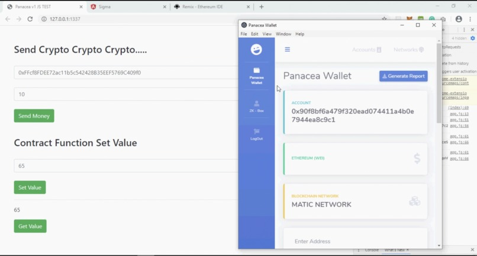
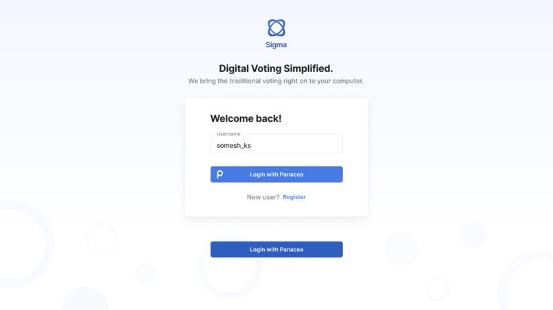

<h1 align="center"> MIT-Bitcoin-Hackathon-2020 </h1>
<h2 align="center"> ZK - Uniwallet </h2>

## Inspiration

Most of the Crypto users use wallets as their primary gateway to enter Web3 for transactions. But, the major limitation of the chrome-based plugins hinders the interactions with other Mobile and Desktop based Dapps. In addition, every existing Crypto wallet out there interacts with a single Blockchain network that hinders the usability and interoperability. The developers are currently limited to writing their codebase for a single Blockchain and not able to support other Blockchains for which they have to rewrite the entire code again!

Also, in the current day world, there is a huge overhead involved in creating a zero-knowledge proofs based application. Significant background knowledge of the working or zk technologies is required, which inspired us to build a redefined platform that improves the overall usability and makes the process simpler. There's a lack of Zero-knowledge based applications in the market that solves the Identity-related problems. Using our zk-box, the developer can get basic zk proofs based functionality out of the box, without worrying about underlying technology.

## Our solution

<h4 align="center"> Universal wallet </h4>

<h4 align="center"> An example Dapp using zk-functionalities </h4>

We have 3 major modules in our project,

a. Panacea wallet

b. Panacea SDK

c. ZK-Box

· Panacea wallet supports operations like the signing of the transaction and other cryptographic operations across multiple platforms and blockchains that improve the overall usability and interoperability.

· Panacea SDK helps Dapp developers to write globally compatible code across any EVM compatible blockchains. 

· With the Panacea SDK, developers can build new wallet solutions that can be used without downloading a separate wallet and if the code is according to the specification the Dapp Developers do not have to change any code to support new Blockchain.

· ZK_Box helps us to authenticate into various applications instantly by generating Zero-knowledge proofs without revealing any of the private data, ie, the password never actually leaves the laptop. It also helps us validate various parameters of the user identity like age using zero-knowledge age proofs. More complicated custom zero-knowledge proof generation like voter anonymization can also be done easily using the ZK-box.  

## How we built it

1. Brainstormed the entire idea using wireframes and user flows.

2. We used Electron.JS for building a desktop wallet app.

3. We used Zokrates for building the ZK-Box.

4. We used Angular and Express.JS for Front-end and Back-end.

## Devpost Submission
The project was submitted on devpost during the hackathon. [Here](https://devpost.com/software/zk-uniwallet) is the submission.
## Contributors 
- [Akash](https://in.linkedin.com/in/akash981) - Blockchain dev
- [Sarang Parikh](https://in.linkedin.com/in/sarang-parikh) - Blockchain dev
- [Riya Singh](https://in.linkedin.com/in/riya-singh-5aa773193) - Frontend dev
- [Somesh K S](https://in.linkedin.com/in/someshks) - UI/UX designer
